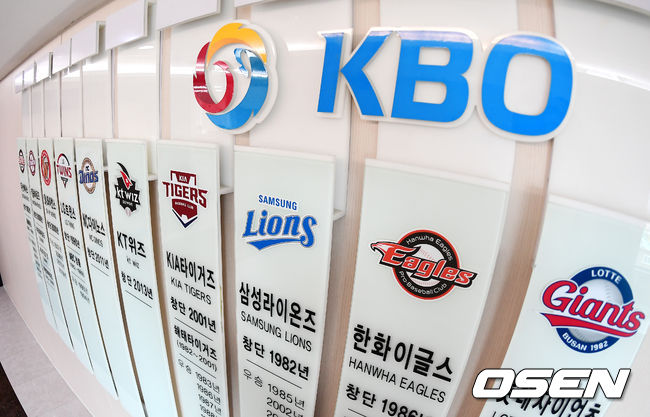
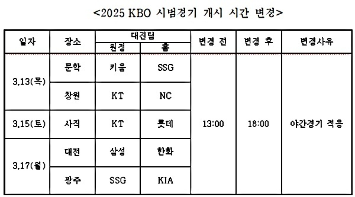
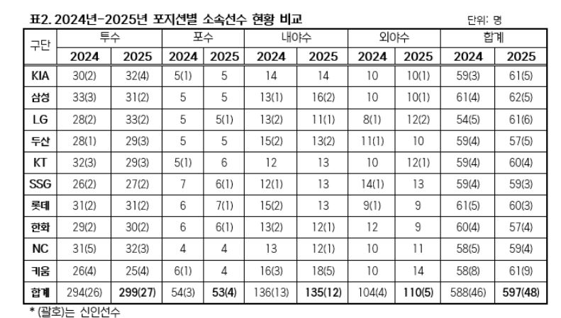
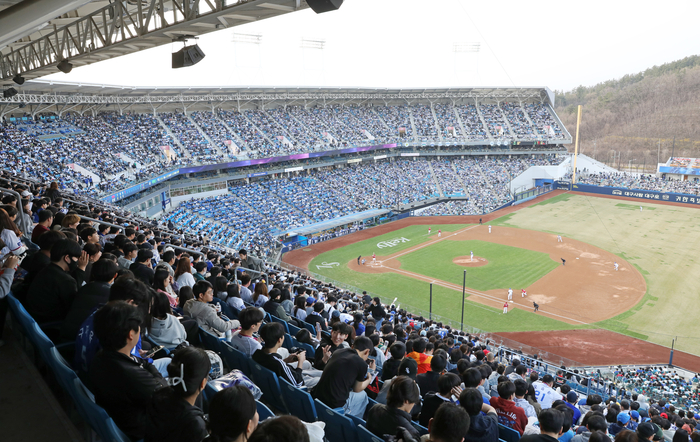
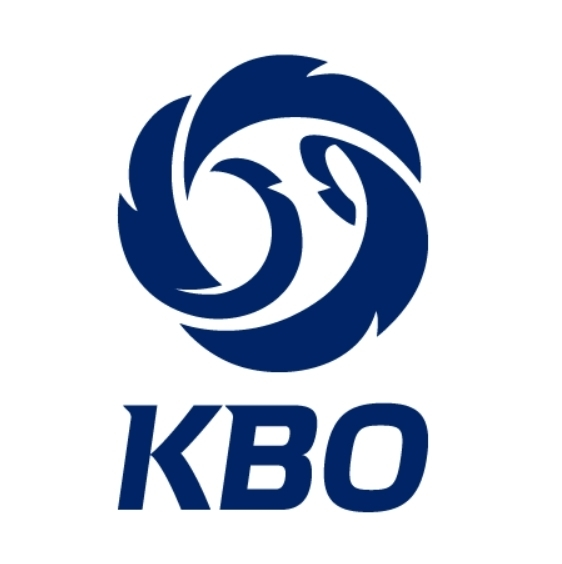
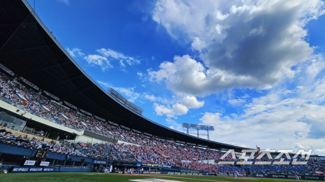
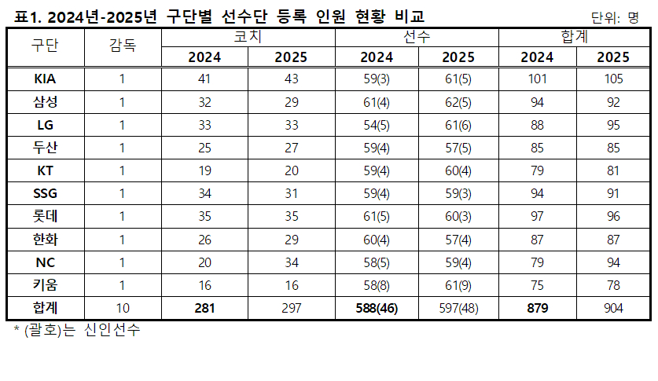
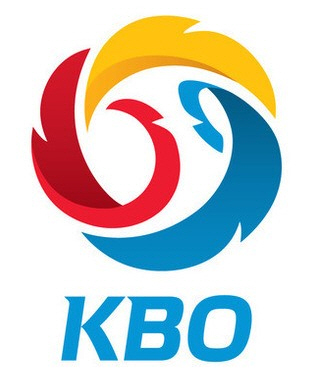

| Timestamp           | Title                             | Image                                     |
|---------------------|-----------------------------------|-------------------------------------------|
| 2025-02-27 08:56:24 | 프로야구, 올해도 1000만 관중 넘을까? |  |
| 2025-02-27 09:04:12 | 프로야구, 올해도 1000만 관중 넘을까? |  |
| 2025-02-25 01:02:00 | 프로야구, 올해도 1000만 관중 넘을까? |  |
| 2025-02-25 01:02:00 | 프로야구, 올해도 1000만 관중 넘을까? |  |
| 2025-02-24 21:10:00 | “최고의 타자와 맞붙고 싶다” KIA 김도영은 KBO 외인투수들에게도 호... |  |
| 2025-02-24 12:51:00 | ‘2025시즌 함께 준비’ KBO, 일부 시범경기 6시 시작…선수단도, 팬들도... |  |
| 2025-02-24 08:44:00 | [오피셜] KBO, 2025 시범경기 일부 '오후 1시→6시' 개시 시간 변경 왜? |  |
| 2025-02-24 07:41:00 | 대전 신구장 첫 경기 삼성-한화전, 3월 17일 오후 1시→6시 시작…KBO 일... |  |
| 2025-02-24 06:35:00 | KBO, 일부 시범경기 개시 시간 변경…5경기 오후 6시 시작 |  |
| 2025-02-24 06:13:00 | 대전 新구장 첫 게임은 '야간경기'로, KBO 일부 시범경기 13시→18시 변경... |  |
| 2025-02-24 04:06:00 | 2025 프로야구 개막 한 달 앞… 흥행 신기록 경신할까? |  |
| 2025-02-21 20:50:00 | 'KBO리그 개막 한 달 앞으로' 2년 연속 1천만 관중 돌파 기대…한화 새 ... |  |
| 2025-02-21 08:16:00 | [퇴근길 포인트] 유럽 5.2%·미국 2.5% 올랐는데 한국은 0.5%↓…트럼프... |  |
| 2025-02-11 06:31:00 | 삼성 최다 62명 선수 등록, KIA는 코치만 44명…2025 KBO 소속 선수 597명... |  |
| 2025-02-11 01:34:00 | ‘삼성 최다 62명’ 2025 KBO리그, 총 597명 등록…투수는 LG 최다-신인은... |  |
| 2025-02-11 01:12:00 | 투수가 절반…2025 KBO 리그 소속 선수 597명 등록, SSG는 59명 |  |
| 2025-02-11 01:07:00 | 선수는 삼성, 코치는 KIA가 최다…KBO, 2025 등록 선수 명단 발표 [공식발... |  |
| 2025-02-11 00:39:00 | [오피셜] KBO 2025년 선수 명단 발표 &quot;삼성이 최다 62명, KIA가 코칭스태... |  |
| 2025-02-05 07:04:00 | 프로야구 KT, 다음달 8일 수원서 LG와 시범경기...SSG는 대구 원정 |  |
