| Timestamp           | Title                             | Image                                     |
|---------------------|-----------------------------------|-------------------------------------------|
| 2025-02-25 01:02:00 | 프로야구, 올해도 1000만 관중 넘을까? |  |
| 2025-02-11 00:39:00 | [오피셜] KBO 2025년 선수 명단 발표 &quot;삼성이 최다 62명, KIA가 코칭스태... |  |
| 2024-09-10 06:14:00 | [2025 KBO 신인 드래프트] 전주고 정우주 vs 덕수고 정현우→배찬승·박... |  |
| 2025-02-27 12:34:00 | 삼성 원태인 '대구로' 홍보영상 전격 출연 |  |
| 2025-02-27 06:36:00 | 류지현 감독, KBO 라이브 방송서 대표팀 구성 방향 소개 |  |
| 2025-03-04 05:09:00 | KBO, 2025 키즈클럽 미래야구의 날 운영 대행 입찰 시행 |  |
| 2025-03-04 01:42:00 | ‘이대로 KBO리그 리턴?’ 고우석, 결국 또 마이너 추락 |  |
| 2025-03-04 05:11:00 | “신발 해졌던데 하나 사” 11억에 두산 택한 다저스맨, 인성도 특급…... |  |
| 2025-03-04 05:32:00 | KBO, 키즈클럽 미래야구의 날 운영 대행 입찰 시행 |  |
| 2025-03-05 00:30:00 | 합작 30승? 콜! 공포의 외인 듀오 |  |
| 2025-03-05 00:41:00 | 韓 11승→견갑골 부상→한국시리즈 불발→美 복귀…'삼성 출신' 코너 KK... |  |
| 2025-03-04 09:45:00 | Florial ready to give 'my 100 percent every time' for new KBO team |  |
| 2025-03-06 00:30:00 | As new captain, Landers pitcher Kim Kwang-hyun looks to lead team to big ... |  |
| 2025-03-05 08:50:00 | SSG 김광현, KBO리그 연봉킹 |  |
| 2025-03-06 04:00:00 | “고영표 공 어느 정도로 떨어지는지 경험해봐…” KIA ML 88홈런 거포는... |  |
| 2025-03-07 00:40:00 | 야구의 계절이 임박했다… ‘전초전’ KBO 시범경기, 8일 개막 | 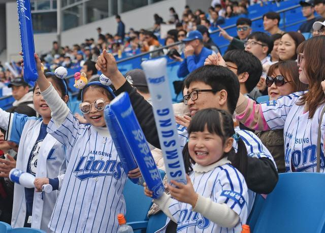 |
| 2025-03-07 00:02:00 | 달라지는 KBO…언더핸드 투수는 안도, 롯데는 긴장 |  |
| 2025-03-08 00:14:00 | 윤석민·김재호, 새 시즌 스포티비에서 해설위원으로 출발 |  |
| 2025-03-07 07:48:00 | 날씨에 웃고 우는 KBO리그, 기상청과 업무협약 체결 |  |
| 2025-03-09 00:20:00 | '이래서 1순위구나' 정현우, 시범경기 데뷔전부터 완벽투…키움 히트상... |  |
| 2025-03-08 14:11:00 | KBO 피치클록 첫 도입, 첫날 위반은 한 건 |  |
| 2025-03-10 00:34:00 | 기아, '더 기아 EV4' 계약 개시 |  |
| 2025-03-09 01:01:00 | SPC삼립, KBO와 '크보빵' 출시…&quot;띠부씰 동봉&quot; |  |
| 2025-03-11 00:28:00 | 다승왕 상대 생일 축포라니…그것도 밀어서 넘겼다, 19세 루키의 화려한... |  |
| 2025-03-12 00:34:00 | 3년 연속 꼴찌 후보? 키움은 늘 '이변'을 보여줬다 |  |
| 2025-03-11 02:33:00 | 김도영·구자욱 총출동하는 KBO 미디어데이 20일 개최 |  |
| 2025-03-13 00:38:00 | &quot;KBO리그 성적 못믿어…한국은 싱글A 더블A&quot; 김혜성 마이너행에 선 넘는... |  |
| 2025-03-12 06:30:00 | KBO리그 극장 생중계 협약 체결한 CGV와 KBO | 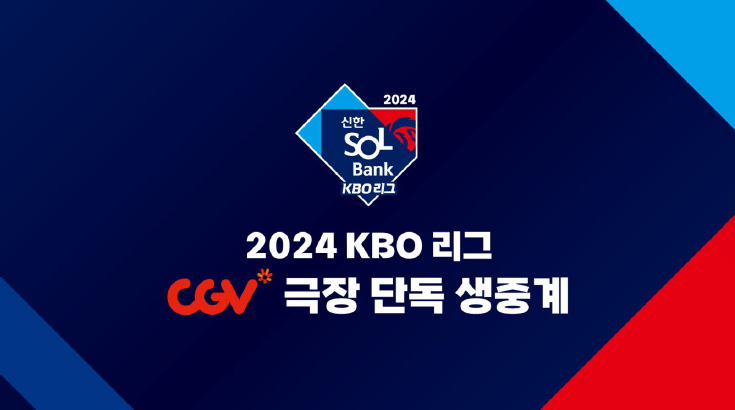 |
| 2025-03-14 00:38:00 | '컴투스프로야구' 시리즈 캠페인 영상, '올해의 광고상', '소비자가 뽑은... | 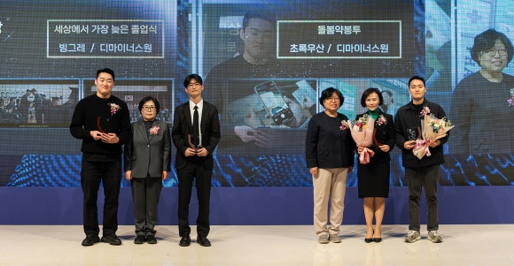 |
| 2025-03-13 05:04:00 | KBO 퓨처스리그 내일 개막…체크 스윙 비디오판독 시범 도입 |  |
| 2025-03-15 00:38:00 | 미성년자 성범죄에 음주운전까지…전 롯데 투수 서준원 사실상 영구퇴출 | 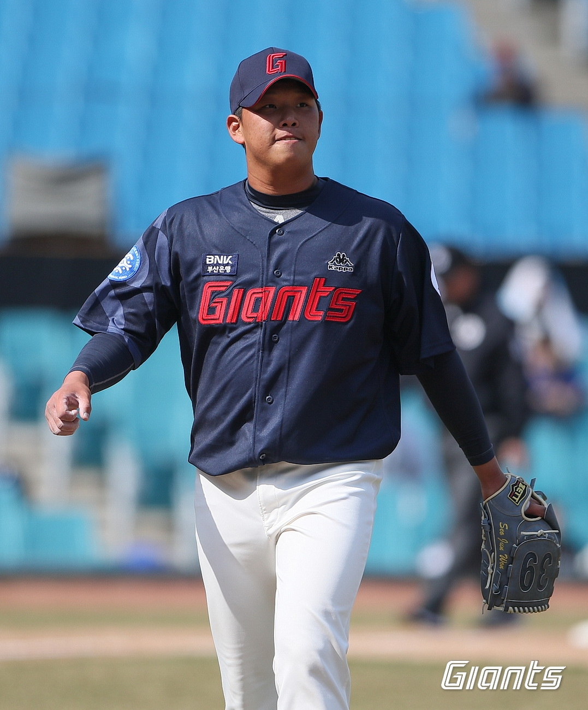 |
| 2025-03-14 08:26:00 | 롯데지주-KBO, 업무협약 체결 |  |
| 2025-03-16 00:43:00 | &quot;김도영? 올해도 실수 많이 하게 될 겁니다&quot; 꽃감독 이야기에 담긴 의미... |  |
| 2025-03-17 00:30:00 | 연세유업X두산베어스, '연세우유 먹산 생크림빵' 출시 |  |
| 2025-03-16 10:31:00 | KBO리그 4대 공식행사, 롯데호텔서 열린다 |  |
| 2025-03-18 00:34:00 | [주목! 이 선수] 암표가 2000만원→선수단에 대형 참치 선물…'50-50'에 투... |  |
| 2025-03-17 05:04:00 | KBO 비디오판독 센터, 호크아이 리플레이 시스템 도입 | 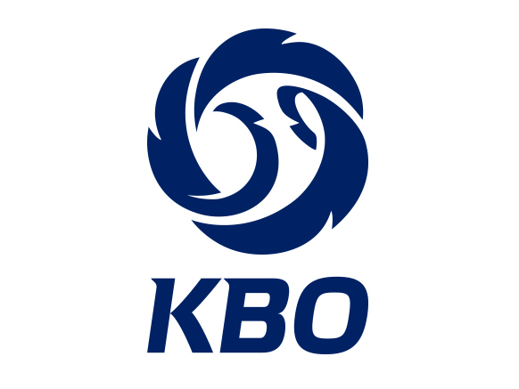 |
| 2025-03-19 00:40:00 | 기아, 'KBO 디스플레이 테마' 공개 |  |
| 2025-03-19 00:02:00 | 기아, 지난해 KBO 우승 기념 '디스플레이 테마' 공개 |  |
| 2025-03-19 07:06:00 | KBO, '크보빵' 10종 정식 출시…롯데 제외 9개 구단 참여 |  |
| 2025-03-21 00:41:00 | “작년보다 더 좋은 모습 보여드릴 것”…새 시즌 앞둔 NC 김형준의 당찬... |  |
| 2025-03-20 13:24:00 | 케이스티파이, KBO 리그 폰케이스 출시 |  |
| 2025-03-22 00:29:00 | 2025 KBO리그 출발…베트맨, 개막맞이 ‘빅이벤트’ 진행 |  |
| 2025-03-21 02:29:00 | '전임 KBO 감독만 5명'…2026 WBC 야구대표팀 코치진 확정 |  |
| 2025-03-23 00:44:00 | [포토] LG유플러스, 프로야구 개막 맞춰 품질 점검 완료 |  |
| 2025-03-22 08:11:00 | Twins rout Giants on KBO Opening Day |  |
| 2025-03-24 00:42:00 | 하이트진로, '켈리 X CGV' 컬래버레이션 마케팅 진행 |  |
| 2025-03-23 16:08:00 | KBO 리그 개막전 전 경기 매진... 역대 최다 관중 동원 |  |
| 2025-03-25 00:40:00 | '컴투스프로야구' 시리즈, KBO 리그 개막 캠페인 영상100만 돌파 |  |
| 2025-03-24 05:55:00 | KBO, 완도군과 동계훈련 시설 구축 업무협약 |  |
| 2025-03-26 00:40:00 | 냄새로는 만족 못해…우승까지 씹어먹자 |  |
| 2025-03-25 10:39:00 | SOOP KBO 그래픽 '입중계' 관심↑ |  |
| 2025-03-27 00:40:00 | 크보빵 이어서 '크보 뉴비' 필독서 나왔다! 지금 사야 김도영-구자욱-윤... |  |
| 2025-03-26 07:25:00 | KBO, 한국야구박물관 로고 발표…&quot;야구 물품 기증해주세요&quot; |  |
| 2025-03-28 00:41:00 | 최고 150km+KKKKK 1피안타 무실점…LG의 개막 5연승 이끈 ‘5선발’ 송승... |  |
| 2025-03-27 08:20:00 | KBO 매진 행진에 야구 예능도 후끈 |  |
| 2025-03-29 00:40:00 | 두산, 만원 관중 앞 홈 개막전 2-0 승리... 강승호 결승타·어빈 7이닝 호... |  |
| 2025-03-28 05:17:00 | KBO, 2차 드래프트 보호 대상 범위 확대 |  |
| 2025-03-30 00:42:00 | “박병호 먼저 도발하는 스타일 아냐” 감독도 발끈…콜어빈과 어떻게... |  |
| 2025-03-31 00:40:00 | [KBO] '디펜딩 챔피언' KIA, 4연패 탈출..'구조물 추락' LG·NC전 취소 |  |
| 2025-03-30 11:46:00 | 창원구장 구조물 추락 사고에도 경기 그대로 진행한 NC·KBO |  |
| 2025-04-01 00:46:00 | 몸값 '619억' 김하성 前 동료, 금지약물 복용→80G 출장정지 중징계 |  |
| 2025-03-31 23:11:00 | KBO, 1일 프로야구 전경기 취소… 관중 사망 사고 여파 |  |
| 2025-04-02 00:39:00 | 올해 기대했는데, 팬들 애태우는 '하위 3팀' 외국인 타자들 |  |
| 2025-04-01 20:04:00 | KBO 역수출 신화 계속된다 |  |
| 2025-04-03 00:19:00 | 김하성도 없는데...샌디에이고, 개막 7연승 질주→다저스와 나란히 |  |
| 2025-04-02 09:42:00 | KBO, 4개 구장 안전 점검 완료…&quot;나머지 구장도 점검 실시 중&quot; |  |
| 2025-04-04 00:16:00 | '6경기 4홀드' 정철원, 2022년 신인왕의 부활 |  |
| 2025-04-03 05:38:00 | 경남 고성·KBO, 야구 전지훈련 경쟁력 강화 방안 모색 |  |
| 2025-04-05 00:40:00 | '1번 타자' 푸이그, 만루포까지…키움의 공격 극대화 대성공 |  |
| 2025-04-04 03:03:00 | KBO, 첨단 장비로 고교 1학년 선수 전원 훈련 데이터 측정 |  |
| 2025-04-06 00:41:00 | “좋은 이야기 나오고 있어” NC 임정호·임상현, 곧 1군에 모습 보이나... |  |
| 2025-04-05 06:16:00 | 최성용 KBO 기록위원, 역대 6번째 3천경기 출장 |  |
| 2025-04-07 00:27:00 | 들쑥날쑥한 공격력·허리진...롯데 '승률 방어' 이끄는 '국내 선발 3인방... |  |
| 2025-04-06 09:21:00 | 계속된 야구 열기…KBO리그, 60경기 만에 100만 관중 '역대 최소' |  |
| 2025-04-08 00:40:00 | 도미노피자, 색다른 1인 피자 ‘썹자’ 출시 |  |
| 2025-04-08 00:02:00 | 도미노피자, 프로야구 개막 기념 KBO 피자 '썹자' 출시 |  |
| 2025-04-09 00:41:00 | “준비한 것 꾸준히 잘하다 보면 좋은 성적 자연스레 따라올 것”…NC 필... |  |
| 2025-04-10 00:41:00 | 실책+주루사→동점 3루타 ‘쾅!’…지옥과 천당 오간 플로리얼, 반등하... |  |
| 2025-04-09 12:31:00 | Heroes beat KBO-leading Twins behind starter's gem |  |
| 2025-04-11 00:41:00 | 류현진 17K 기록에 탄성 내지른 14K 외인 “그는 진짜 전설이다, 기록에... |  |
| 2025-04-10 10:43:00 | [사진]KBO 통산 4번째 2400안타 날리는 김현수 |  |
| 2025-04-12 00:40:00 | KIA, SSG에 3-9 완패 |  |
| 2025-04-11 14:24:00 | “울산을 야구 거점도시로”…KBO와 협약 체결 |  |
| 2025-04-13 02:00:00 | 김혜성, 이틀 연속 홈런쇼…美 마이너리그 무대 흔든 괴력 스윙 |  |
| 2025-04-14 00:42:00 | 무신사 플레이어, 인기 프로 야구·축구 구단들과 협업 |  |
| 2025-04-14 00:29:00 | 무신사, 'KBO·K리그·산리오' 굿즈 출시 |  |
| 2025-04-15 00:41:00 | ‘KIA 어쩌나’ 좌완 필승조 곽도규, 끝내 수술대 오른다…김도영은 복... |  |
| 2025-04-14 04:07:00 | 무신사, KBO·K리그와 '고 팀 무신사' 캠페인 진행 |  |
| 2025-04-16 00:43:00 | 조상우+최지민+정해영 완벽투→시즌 첫 무실점 승리...이게 KIA가 원했던... |  |
| 2025-04-15 05:58:00 | ‘2008 금메달 주역’ 정대현, 올림픽 메달 KBO에 기증 |  |
| 2025-04-17 00:41:00 | 박소영 치어리더, 눈웃음좌의 색다른 모습![엑's 숏폼] |  |
| 2025-04-16 12:17:00 | KBO-leading Twins lose starter Hernandez due to leg injury |  |
| 2025-04-18 00:40:00 | 류지현 데뷔전이 WBC 아닌 11월 한일 평가전. '또 한번의 도쿄 대첩'일까... |  |
| 2025-04-17 04:51:00 | 'KBO팬 모여라' | 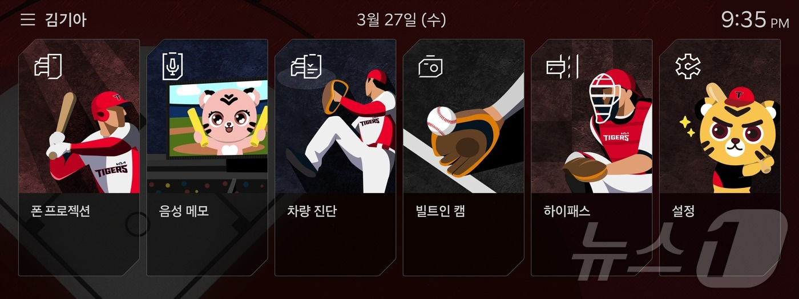 |
| 2025-04-19 00:37:00 | 롯데, 홈런 3방 터트리며 삼성 8-1로 꺾고 승리… 4연승 행진 |  |
| 2025-04-18 06:13:00 | KBO, 실시간 트래킹 데이터도 중계로…시각화 콘텐츠 시범 운영 |  |
| 2025-04-20 00:45:00 | 로하스 멀티홈런-소형준 11K 쇼... KT 연패 탈출 |  |
| 2025-04-21 00:44:00 | &quot;롯데 자이언츠 팬 모여라&quot;…세븐일레븐, ‘마! 응원’ 협업 상품 출시 |  |
| 2025-04-21 00:00:00 | 'I'm more than just a baseball player': KBO pitcher Cole Irvin wants to s... | 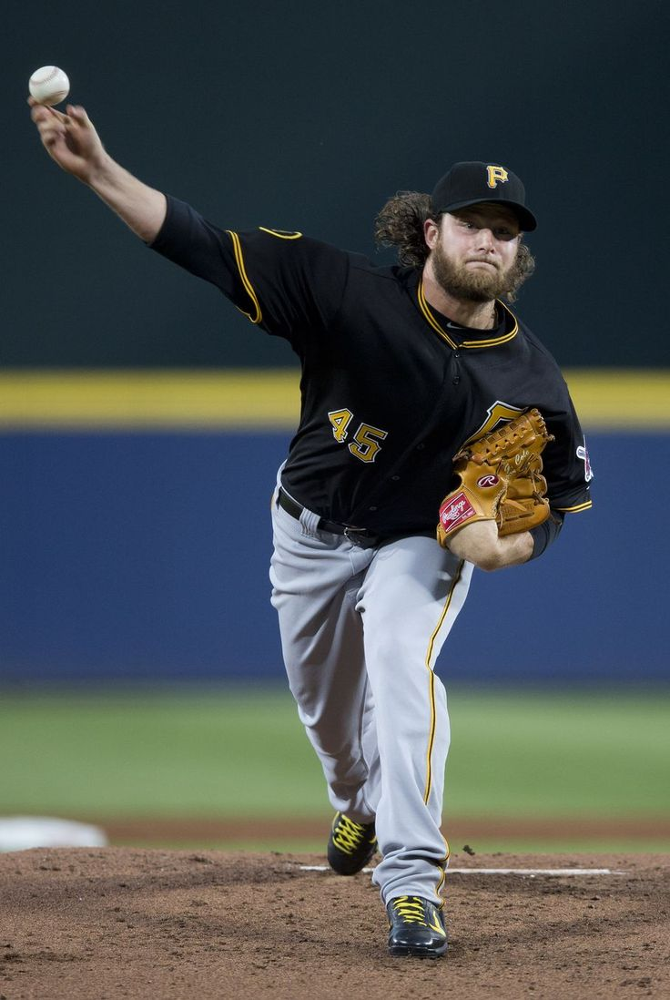 |
| 2025-04-22 00:42:00 | “최고 150km, 스위퍼도 던진다” 왜 아시아쿼터 테스트 투수를 대체 외... | 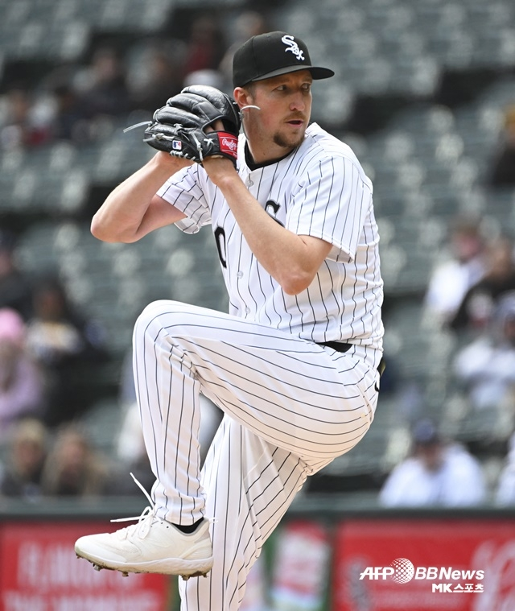 |
| 2025-04-22 00:38:00 | Flying high again: Eagles soar in KBO standings thanks to dominant pitchi... |  |
| 2025-04-23 00:42:00 | 신한금융그룹, KBO·K리그 무대에서 펼치는 '소방 가족의 날' |  |
| 2025-04-22 23:25:00 | 2025 KBO리그. 역대 최소 경기 200만 관중...평균 19% 증가 |  |
| 2025-04-24 00:41:00 | 대타로 출전해 쐐기 2타점 적시 2루타 ‘쾅!’…베테랑의 품격 보여준 ... | 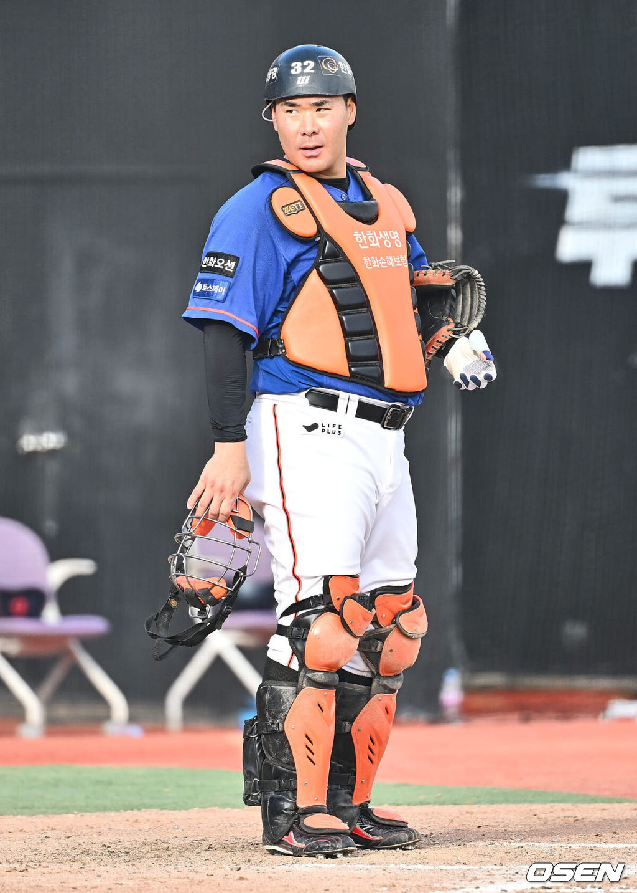 |
| 2025-04-25 00:42:00 | ‘엘동원 부상’ LG 대체 외인, 드디어 왔다. 그런데 왜 24일 입국하자마... | 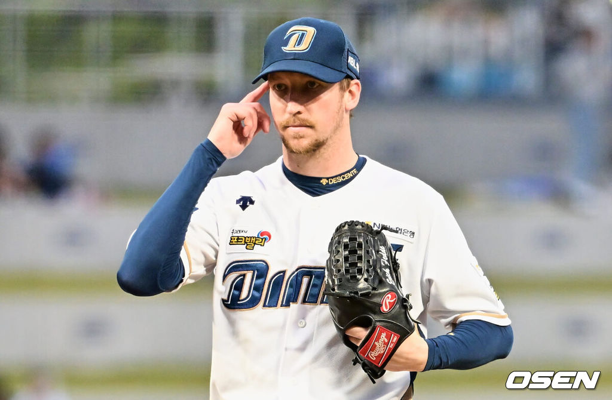 |
| 2025-04-24 07:31:00 | '중계권 청탁' 대가로 금품수수한 KBO 임원, 1심 무죄 |  |
| 2025-04-25 13:31:00 | [사진] 한석현, 홈런 기념촬영 중 |  |
| 2025-04-26 00:41:00 | ‘ERA 6.89→KKKKKK 1실점’ 친정팀 상대 쾌투한 한화 엄상백, 반등 계기... |  |
| 2025-04-27 00:46:00 | &quot;도영아 고맙고 행복해&quot; 갑자기 왜?…'홈런 1위' 몸살에 깜짝 선발→125... |  |
| 2025-04-26 20:50:00 | [Z시세]야구, 이제는 일상…1000만 야구팬 홀린 KBO 컬래버의 세계 |  |
| 2025-04-28 00:41:00 | &quot;프로야구 보러 오세요&quot; 에버랜드, '베이스볼 위크' 진행 |  |
| 2025-04-29 00:30:00 | 도미노피자, ‘KBO 콜라보레이션 키링 굿즈’ 프로모션 진행 |  |
| 2025-04-28 09:11:00 | 이택근·이대형 해설위원, KBO 전력강화위원에 선임 |  |
| 2025-04-29 23:52:00 | &quot;KBO 열풍 타고 홈런&quot;…삼립 '크보빵' 1000만봉 판매 돌파 |  |
| 2025-05-01 00:45:00 | '1위와 단 2G차' 롯데 이래서 강하구나, 자꾸 어디서 선수가 나온다... 타... |  |
| 2025-04-30 13:00:00 | Ex-KBO MVP heating up after adjusting to new strike zone |  |
| 2025-05-02 00:41:00 | 두산 데뷔전서 홀드에 화끈한 포효까지…다시 돌아가는 고효준의 야구 ... |  |
| 2025-05-01 23:50:00 | (Yonhap Interview) Unheralded rookie pitcher eyes big KBO prize |  |
| 2025-05-03 00:41:00 | “선수처럼 할 수 있을까”→복귀 첫 타석서 결승 2점포 ‘쾅!’…미소... |  |
| 2025-05-02 23:00:00 | (Yonhap Interview) Young family helps veteran KBO pitcher get over bad ga... |  |
| 2025-05-04 00:42:00 | 다저스 김혜성, 마침내 MLB 콜업… 역대 28호 한국인 빅리거 눈앞 |  |
| 2025-05-05 00:41:00 | “아시아 쿼터로 한국 돌아오고파”…데뷔전서 승리 따낸 LG 코엔 윈의 ... |  |
| 2025-05-04 08:42:00 | 'KBO 데뷔전서 선발승' 윈 &quot;생애 가장 중요한 등판, 일단 성공&quot; | 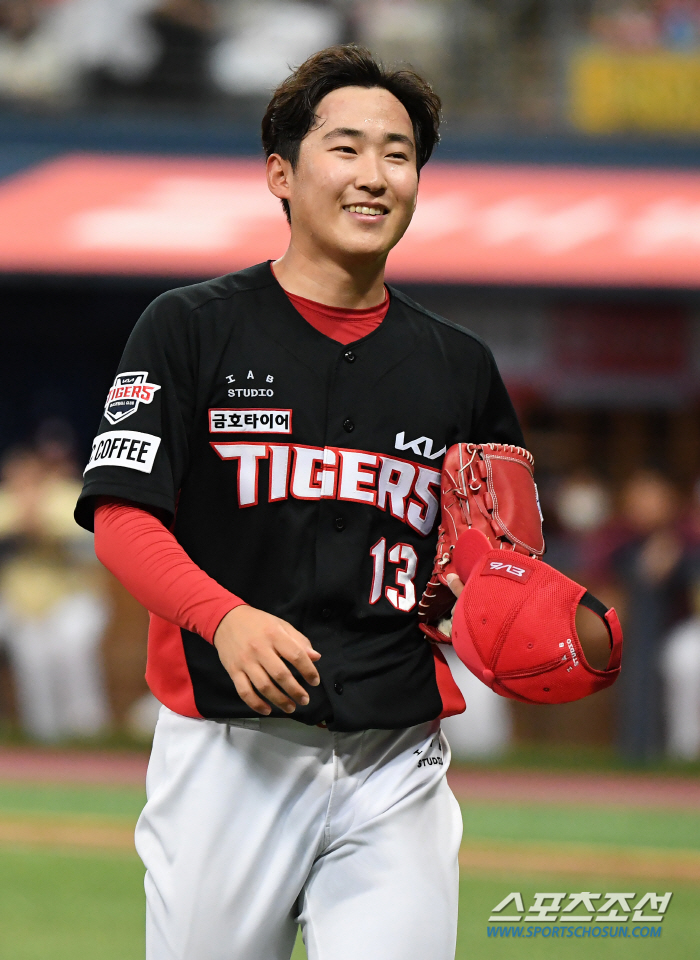 |
| 2025-05-06 00:41:00 | “앞으로 더 많은 승리에 기여하고파”…7전 8기 끝 첫 승 따낸 NC 로건... |  |
| 2025-05-05 07:58:00 | KBO리그, 역대 최소 175경기 만에 300만 관중 돌파 | 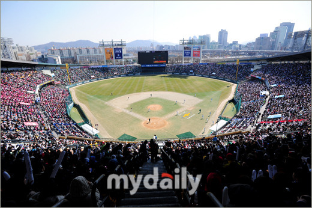 |
| 2025-05-07 00:41:00 | “선수단 모두 힘을 내 승리 위해 노력 중”…기나긴 원정 생활에도 김... |  |
| 2025-05-06 07:14:00 | KBO 유니폼 띠부씰 담은 ‘모두의 크보빵’ 나왔다 |  |
| 2025-05-08 00:44:00 | 갈 길 바쁜 KIA, '천군만마' 이의리 6월 복귀…&quot;조만간 퓨처스 등판 결정... |  |
| 2025-05-09 00:42:00 | 주전 선수들 잇따라 이탈… 기아 타이거즈, 부상 악재 '또' 덮쳤다 |  |
| 2025-05-08 05:50:00 | 폰세, KBO리그 3∼4월 MVP…한화 외국인 투수 최초 수상자 |  |
| 2025-05-10 00:41:00 | 개막 로스터 탈락→39G 만에 콜업…'40억' 사이드암의 반성과 각오 &quot;무에... |  |
| 2025-05-09 13:40:00 | (LEAD) Eagles rally past Heroes for 10th straight win in KBO |  |
| 2025-05-11 00:42:00 | ‘5회까지 97구→6회 등판 자청→112구 무실점’ 투혼의 외인 투수, 이러... |  |
| 2025-05-10 04:11:00 | KBO club sticking to alternate stadium plan despite home city's offer |  |
| 2025-05-11 23:49:00 | '불꽃야구' 대학 No.1 사이드암→KBO 전설의 마구 주인공 출격 |  |
| 2025-05-13 00:20:00 | 도미노피자, KBO 열풍 잇는 '리틀야구대회' 성료 | 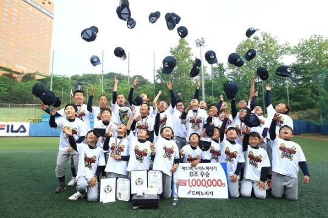 |
| 2025-05-14 00:36:00 | 디아즈 16호 대포+이승현 시즌 첫 무실점 피칭! 삼성, '약속의 땅'에서 ... |  |
| 2025-05-13 11:37:00 | Quiet KBO star burnishes legacy with 500th home run |  |
| 2025-05-15 00:41:00 | 한화 16경기 연속 매진, 김경문 &quot;류현진 덕에 인기 더 올랐다&quot; [IS 대전] |  |
| 2025-05-16 00:42:00 | KBO '월간 씬-스틸러상' 3~4월 수상자에 한화 홍창화 응원단장 |  |
| 2025-05-17 00:41:00 | “패스트볼 힘 있더라”…호부지 칭찬 받은 김태훈, NC 불펜진에 힘 보... |  |
| 2025-05-18 00:46:00 | 한화 이글스 코디 폰세, KBO리그 외인 선수 최초 투수 4관왕 도전 |  |
| 2025-05-17 23:16:00 | '정규이닝 18K 신기록' 폰세, KBO 외국인 투수 최초 4관왕 도전 |  |
| 2025-05-19 00:46:00 | 티빙, 배달의민족과 ‘통합 멤버십 상품’ 6월 출시한다 |  |
| 2025-05-18 09:19:00 | 역대 최소 경기 '400만 관중'…KBO리그 최고 인기 팀은? |  |
| 2025-05-20 00:45:00 | 불펜투구 시작 했다는데.. 곽빈·홍건희 5월에 올 수 있나 → 복귀 작전... |  |
| 2025-05-19 02:33:00 | [게시판] 동국제약, '마데카 쿨링패치 KBO 에디션' 출시 |  |
| 2025-05-21 00:42:00 | 2군→대체선발→2군→대체선발, 불안한 입지에도 왜 “행복하다” 웃었... |  |
| 2025-05-20 05:29:00 | 허구연 KBO 총재, 양현종 선수협회장과 리그 발전 협력 논의 |  |
| 2025-05-22 00:41:00 | “팀 우승을 위해 끝까지 노력하겠다”…역투로 NC 한화전 4연패 탈출 이... |  |
| 2025-05-23 00:41:00 | '6→5→4.2→3.1이닝' 떨어지는 신뢰도. 아시아쿼터 테스트 이러면 실패... |  |
| 2025-05-22 04:15:00 | KBO 드림컵 독립야구대회, 23일 강원도 횡성서 개막 |  |
| 2025-05-24 00:42:00 | '홈런의 덫' 빠진 김재윤…불펜 고민 깊어지는 삼성라이온즈 |  |
| 2025-05-25 00:50:00 | 1073일 만의 선발 등판서 4⅓이닝 3실점...다시 기회 잡은 SSG 전영준, LG... |  |
| 2025-05-24 05:40:00 | 선관위 “대선일 대전·창원 야구 낮에 해달라”… KBO 수용 |  |
| 2025-05-26 00:40:00 | '원투 펀치'가 ERA 1~2위, 압도적 꼴찌가 0.5경기차 2위로 대반전, 승률... |  |
| 2025-05-27 00:42:00 | “빵빵~” 대전빵차 시즌2…'0시 축제' 홍보 전국 누빈다 |  |
| 2025-05-26 06:48:00 | &quot;내 선수 얼굴, 피 묻은 빵에 쓰지 마라&quot;…KBO 팬들 분노 |  |
| 2025-05-28 00:44:00 | 완전 날벼락 소식…김도영과 기아 타이거즈, 초대형 '악재' 또 터졌다 |  |
| 2025-05-27 05:09:00 | KBO, 신한은행과 10년 동행…2027년까지 타이틀 스폰서 연장 |  |
| 2025-05-29 00:41:00 | ‘최고 153km 쾅!+KKKKKKKK 1실점’ 재정비 시간 가지고 있는 NC 특급 루키... |  |
| 2025-05-28 02:18:00 | 신한은행, 2027년까지 KBO 타이틀 스폰서 맡는다 |  |
| 2025-05-30 00:44:00 | '데뷔 첫 세이브' 김영우, 신인왕 후보 자격 증명 |  |
| 2025-05-29 05:24:00 | SPC삼립, ‘크보(KBO)’빵 생산 멈춘다… “3교대 시범 운영” |  |
| 2025-05-31 00:41:00 | 끝없는 추락 어디가 바닥인가, 10경기-15득점 빈타 '꼴찌' 야쿠르트, 괴... |  |
| 2025-05-30 08:55:00 | KBO, NC 연고지 이전 검토에 &quot;창원에 NC 적극 지원 요청해왔다&quot; |  |
| 2025-06-01 00:54:00 | 세븐일레븐, 사직구장서 가맹점과 상생 응원 |  |
| 2025-05-31 08:28:00 | “KBO 굿즈 여기서만 팔아요”…편의점부터 무신사까지 ‘스포츠 협업’... |  |
| 2025-06-02 00:46:00 | 기아, 'EV 트렌드 코리아 2025'에 미래 모빌리티 비전 공개 |  |
| 2025-06-02 00:14:00 | Streaky Lions looking to crack top 3 in KBO |  |
| 2025-06-03 00:44:00 | &quot;ML 125년 만에 첫 기록&quot; 김혜성 메츠전 '9번 유격수' 선발 복귀…KBO 출... |  |
| 2025-06-02 06:06:00 | KBO리그 5월 MVP 후보 발표…한화 폰세, 두 달 연속 수상 도전 |  |
| 2025-06-04 00:44:00 | 도미노피자, 색다른 1인 피자 ‘썹자’ 판매 전 매장으로 확대 |  |
| 2025-06-03 10:55:00 | KBO리그, 294경기 만에 500만 관중 돌파…역대 최소경기 신기록 |  |
| 2025-06-05 00:43:00 | '하루 만의 설욕' NC가 보여준 야구의 묘미...&quot;0-15 참패→6-5 승리&quot; 선두... |  |
| 2025-06-04 12:57:00 | Tigers beat Bears for 3rd straight win in KBO |  |
| 2025-06-06 00:40:00 | 도미노피자, 1인 피자 '썹자' 전 매장서 판매 |  |
| 2025-06-05 08:46:00 | KBO, LAP과 협업 상품 ‘레터링 리본 핀’ 출시 |  |
| 2025-06-07 00:42:00 | '11번째 야구단 탄생?' 충북에 돔구장→프로야구단 유치 로드맵 가동 |  |
| 2025-06-06 06:34:00 | KBO, '호국보훈의 달' 맞아 보훈부 캐릭터 '보보' 패치 달고 경기 진행 |  |
| 2025-06-08 00:43:00 | KIA, 잔루 10개에 좌절하다…'한화 상대 KKKKKKKKK' 올러 7이닝 역투 빛났... |  |
| 2025-06-09 00:40:00 | [N잡 앱테크] 신한 쏠퀴즈, 6월 9일 오늘의 퀴즈 정답 |  |
| 2025-06-08 12:39:00 | '송승기 호투' LG, 키움 꺾고 선두 수성…삼성 후라도 KBO 데뷔 첫 완봉... |  |
| 2025-06-09 05:37:00 | 한화 마무리 김서현, KBO 올스타 팬 투표 중간 집계 1위 |  |
| 2025-06-11 00:45:00 | '통합우승 주역' 함덕주, 퓨처스리그서 재기 시동...이정용 17일 전역으... |  |
| 2025-06-12 00:40:00 | [유통딜리버리] GS25ㆍ올리브영ㆍ쿠팡ㆍ신세계百ㆍ롯데마트ㆍSSG닷컴ㆍ... |  |
| 2025-06-11 12:13:00 | 최형우 KBO 최초 4천300루타 달성 |  |
| 2025-06-12 01:10:00 | KBO '씬-스틸러상' 5월 수상자로 '한 경기 18K' 폰세 선정 |  |
| 2025-06-14 00:41:00 | “잘 정립해 던지면 좋은 승부할 수 있을 것”…자신감 되찾은 NC 신영우... |  |
| 2025-06-13 23:00:00 | KBO 전구단 한 시즌 최다 관중 돌파하나…삼성 160만명 페이스 |  |
| 2025-06-15 00:51:00 | 부상 병동 롯데, '정신력' 아닌 '실력'으로 버틴다…&quot;기술 크게 향상돼... |  |
| 2025-06-14 13:20:00 | Former MLB, KBO star Choo Shin-soo sent off in emotional ceremony |  |
| 2025-06-16 00:48:00 | 티빙, 웨이브와 ‘더블 이용권’ 출시...“하나의 구독으로 두 플랫폼 ... |  |
| 2025-06-16 00:13:00 | Back on top in KBO, Eagles in for another big series |  |
| 2025-06-17 00:45:00 | SSG 랜더스, 28일 ‘짐승’ 김강민 은퇴식 개최 |  |
| 2025-06-16 06:41:00 | 한화 김서현, KBO 올스타 1·2차 팬투표 1위 질주 |  |
| 2025-06-18 00:44:00 | 안경 쓴 타자를 주목하라, 한화 안치홍의 시즌 첫 '대포' |  |
| 2025-06-17 11:46:00 | 박해민, KBO 최초 12시즌 연속 20도루 |  |
| 2025-06-19 00:43:00 | 고우림 &quot;5살 연상 ♥김연아에 목소리로 어필했다&quot;(라디오스타) |  |
| 2025-06-18 13:49:00 | Twins walk off Dinos to snap losing streak in KBO |  |
| 2025-06-20 00:41:00 | KKKKKKKKKK, 11호 QS, 157km 광속구까지 꽝! 갈수록 괴물이다...올러 &quot;미국... |  |
| 2025-06-19 06:03:00 | 에버랜드, KBO와 ‘최강레시 시즌2’ 출시 |  |
| 2025-06-21 00:39:00 | 롯데, 22일 ‘크러시 페스티벌’ 진행…시구자는 레드벨벳 웬디 |  |
| 2025-06-22 00:42:00 | 작년만 못하다고? 왕자님의 응원 당부 → &quot;팬들은 정말 속이 많이 뒤집... |  |
| 2025-06-23 00:46:00 | 김운남 고양시의회 의장 &quot;프로야구 관중 늘어나는데, 노후 홈구장 안전... |  |
| 2025-06-23 00:15:00 | Tigers seeking to stretch winning streak vs. last-place club in KBO |  |
| 2025-06-24 00:45:00 | 야구 올스타전 명단에서 가장 눈에 띄는 이름 |  |
| 2025-06-23 06:42:00 | SSG 최정 등 2025 KBO 올스타전 베스트12 확정 |  |
| 2025-06-25 00:46:00 | 디트로이트에서 ML 데뷔 꿈 이룰까 “고우석, 디트로이트와 마이너리그... |  |
| 2025-06-24 23:36:00 | 야구 덕후 모여라…CGV, 극장 최초 ‘KBO 콜라보 굿즈’ 출시 |  |
| 2025-06-26 00:45:00 | 선두 한화, '2경기 10실점' 문동주에 기회 '한번 더'...삼성은 가라비토... |  |
| 2025-06-25 00:55:00 | 팝콘버킷에 캔쿨러…CGV, 'KBO 협업 굿즈' 출시 |  |
| 2025-06-27 00:41:00 | ‘폰세+류현진 vs 앤더슨+화이트’ 리그 1위·2위 선발진 대격돌, 역대급... |  |
| 2025-06-27 00:27:00 | (Yonhap Interview) On temporary KBO deal, Heroes pitcher Wells trying to ... |  |
| 2025-06-28 00:42:00 | ‘군대도 현역 다녀왔는데’ 1차지명 특급 우완, 투런포-만루포-솔로포... | 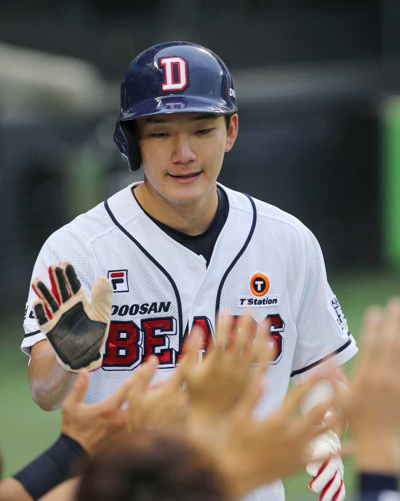 |
| 2025-06-27 05:28:00 | KBO, 2026 신인 드래프트 참가 신청 접수…8월 18일까지 |  |
| 2025-06-29 00:51:00 | '앤더슨과 맞대결 승리' 폰세, ERA 1위 되찾아...11승+4관왕 도전 |  |
| 2025-06-30 00:50:00 | &quot;이주형과 함께 뛰는 게 목표&quot;였던 이주형, KBO리그 역대 '5번째' 기록 탄... |  |
| 2025-06-30 00:22:00 | CJ온스타일, 내달 7일 'KBO 피규어 텀블러' 첫 선 |  |
| 2025-07-01 00:52:00 | 신한은행, '1982 전설의 적금' 출시…&quot;신한과 KBO 리그의 시작, 1982년을... |  |
| 2025-06-30 14:26:00 | CJ온스타일, 'KBO 피규어 텀블러' 내달 출시 |  |
| 2025-07-01 05:41:00 | KBO 홈런더비 출전자 8명 '100％ 팬 투표'로 뽑는다 |  |
| 2025-07-03 00:42:00 | ‘153km-153km-153km-153km’ 시원한 데뷔전, LG에 또 파이어볼러 신인 등... |  |
| 2025-07-02 01:19:00 | 전상현·감보아 등 6명, KBO리그 6월 월간 MVP 후보 선정 |  |
| 2025-07-04 00:46:00 | KIA 김태군·성영탁, 구단 지정병원 월간 MVP 선정 |  |
| 2025-07-04 00:10:00 | KBO, 올스타전 맞아 대전역에 '팝업스토어' 운영 |  |
| 2025-07-05 00:35:00 | '전반기 피날레' 장식할 역대급 맞대결 성사, KIA 에이스도 기대만발 &quot;힘... |  |
| 2025-07-06 00:49:00 | 폰세 대신 황준서! KIA 네일과 한판 승부…최종 리허설은 '성공적' [고척... |  |
| 2025-07-07 00:48:00 | '대반전' 한화, 창단 이후 첫 역사도 썼다! 최고의 전반기 보내며 시리... |  |
| 2025-07-06 10:54:00 | '홈런 4방' 불뿜은 한화…33년 만에 전반기 1위 확정 |  |
| 2025-07-08 00:44:00 | KBO 총재 허구연, 젊은 층 인기 실감…암표 문제는 현실적으로 어려움 |  |
| 2025-07-07 12:01:00 | 허구연 KBO 총재 &quot;젊은 층 인기 실감…암표 대응은 현실적으로 어려워&quot; |  |
| 2025-07-08 07:22:00 | KBO, 폭염 대응책 발표…클리닝타임 최대 10분 연장 |  |
